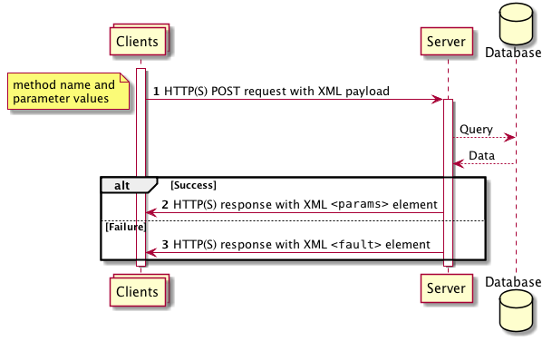

# Demo Doc

Let’s include some Python\!

Use M4 to insert code with this directive

m4\_esyscmd(\[\[sed -ne ‘/import xmlrpc.client/,+6p’ demo4.py\]\])

``` python
import xmlrpc.client

host = "localhost"
port = "8080"
urlEndPoint="http://"+host+":"+port+"/users"

proxy = xmlrpc.client.ServerProxy(urlEndPoint) 
```

A diagram



That’s it folks Published on DATE: 2018-01-10 TIME: 12:15:35
